# M00/M01 Engineering Task Dependency DAG

## Authority and legend

- Effective Architecture Commit: `4ad0b9fa6f3b4a20a8f3ea480724c2fbe3098c14`.
- Walking Skeleton Schema: `1.0.0`, SHA-256 `5b22d0a3e668244896483132d795794687b4b90379228c5815c0f32a1f7a1577`.
- Green nodes satisfy task-level `READY`; gray nodes are dependency-blocked; red is architecture-blocked; thick blue borders mark the current critical path. Execution remains pending Technical Director re-review.
- An arrow is a hard merge dependency. A consumer branch may prepare a local branch, but it may not implement or merge against an invented producer shape.

## Complete task DAG

```mermaid
flowchart LR
    subgraph B0["Batch 0 — accepted contract and immutable fixtures"]
        A01["M00-WP0001-T01<br/>root bootstrap"]
        CFX["M00-WP0002-T01<br/>contract fixtures"]
        WFX["M01-WP0104-T01<br/>synthetic CSV + oracle"]
    end

    subgraph M00R["M00 / WP-0001 Repository"]
        A02["M00-WP0001-T02<br/>clean-clone proof"]
    end

    subgraph M00C["M00 / WP-0002 Contract gate"]
        C02["M00-WP0002-T02<br/>kernel scalars"]
        C03["M00-WP0002-T03<br/>Python contracts"]
        C04["M00-WP0002-T04<br/>TS + OpenAPI"]
        C05["M00-WP0002-T05<br/>conformance gate"]
    end

    subgraph M00P["M00 / WP-0003 Runtime and persistence"]
        P01["M00-WP0003-T01<br/>Compose core"]
        P02["M00-WP0003-T02<br/>typed config"]
        P03["M00-WP0003-T03<br/>Alembic base"]
        P04["M00-WP0003-T04<br/>runtime gate"]
    end

    subgraph M00Q["M00 / WP-0004 Quality"]
        Q01["M00-WP0004-T01<br/>root CI"]
        Q02["M00-WP0004-T02<br/>architecture tests"]
        Q03["M00-WP0004-T03<br/>safe observability"]
        Q04["M00-WP0004-T04<br/>M00 certification"]
    end

    subgraph MG["M01 / WP-0101 Model Gateway"]
        G01["M01-WP0101-T01<br/>gateway port/router"]
        G02["M01-WP0101-T02<br/>Fake provider"]
        G03["M01-WP0101-T03<br/>compatible adapter"]
        G04["M01-WP0101-T04<br/>gateway policy"]
        G05["M01-WP0101-T05<br/>public health body"]
    end

    subgraph PG["M01 / WP-0102 Privacy Gate"]
        V01["M01-WP0102-T01<br/>privacy decisions"]
        V02["M01-WP0102-T02<br/>P2 minimizer"]
        V03["M01-WP0102-T03<br/>zero-leak gate"]
    end

    subgraph HR["M01 / WP-0103 Harness"]
        H01["M01-WP0103-T01<br/>state/registry"]
        H02["M01-WP0103-T02<br/>control persistence"]
        H03["M01-WP0103-T03<br/>budget/permission"]
        H04["M01-WP0103-T04<br/>checkpoint/resume"]
        H05["M01-WP0103-T05<br/>Celery/fault gate"]
    end

    subgraph WS["M01 / WP-0104 Walking Skeleton"]
        W02["M01-WP0104-T02<br/>CSV parser"]
        W03["M01-WP0104-T03<br/>ledger + snapshot"]
        W04["M01-WP0104-T04<br/>wealth persistence"]
        W05["M01-WP0104-T05<br/>workflow producer"]
        W06["M01-WP0104-T06<br/>FastAPI consumer"]
        W07["M01-WP0104-T07<br/>SSE consumer"]
        W08["M01-WP0104-T08<br/>Web consumer"]
        W09[["M01-WP0104-T09<br/>VERTICAL INTEGRATION"]]
        W10["M01-WP0104-T10<br/>data/privacy resilience"]
        W11[["M01-WP0104-T11<br/>M01 EXIT GATE"]]
    end

    A01 --> A02
    A02 --> C02
    CFX --> C02
    A02 --> C03
    CFX --> C03
    C02 --> C03
    A02 --> C04
    C03 --> C04
    C03 --> C05
    C04 --> C05

    A02 --> P01
    A02 --> P02
    P01 --> P02
    P01 --> P03
    P02 --> P03
    P01 --> P04
    P02 --> P04
    P03 --> P04

    A02 --> Q01
    C05 --> Q01
    A02 --> Q02
    C02 --> Q03
    Q02 --> Q03
    A02 --> Q04
    C05 --> Q04
    P04 --> Q04
    Q01 --> Q04
    Q02 --> Q04
    Q03 --> Q04

    C05 --> G01
    Q04 --> G01
    G01 --> G02
    G01 --> G03
    G02 --> G03
    P02 --> G03
    G01 --> G04
    G02 --> G04
    G03 --> G04
    Q03 --> G04
    G04 --> G05
    W06 --> G05

    C05 --> V01
    Q03 --> V01
    Q04 --> V01
    V01 --> V02
    WFX --> V02
    G04 --> V03
    V01 --> V03
    V02 --> V03

    C05 --> H01
    Q04 --> H01
    H01 --> H02
    P04 --> H02
    H01 --> H03
    G04 --> H03
    V03 --> H03
    H02 --> H04
    H03 --> H04
    H04 --> H05
    P04 --> H05

    WFX --> W02
    C02 --> W02
    C03 --> W02
    Q04 --> W02
    WFX --> W03
    C02 --> W03
    C03 --> W03
    Q04 --> W03
    H02 --> W04
    W03 --> W04
    G04 --> W05
    V03 --> W05
    H05 --> W05
    W02 --> W05
    W03 --> W05
    W04 --> W05
    W05 --> W06
    C04 --> W06
    H02 --> W07
    W05 --> W07
    W06 --> W07
    C04 --> W08
    W06 --> W08
    W07 --> W08
    W05 --> W09
    W06 --> W09
    W07 --> W09
    W08 --> W09
    W09 --> W10
    G04 --> W10
    V03 --> W10
    H05 --> W10
    W10 --> W11
    H05 --> W11

    classDef ready fill:#d9f7df,stroke:#16794b,color:#0b3b25
    classDef blocked fill:#f1f3f5,stroke:#6c757d,color:#343a40
    classDef arch fill:#ffe3e3,stroke:#c92a2a,color:#7b1111
    classDef critical stroke:#1864ab,stroke-width:4px
    class A01,CFX,WFX ready
    class A02,C02,C03,C04,C05,P01,P02,P03,P04,Q01,Q02,Q03,Q04,G01,G02,G03,G04,V01,V02,V03,H01,H02,H03,H04,H05,W02,W03,W04,W05,W06,W07,W08,W09,W10,W11 blocked
    class G05 arch
    class A01,A02,C02,C03,C04,C05,Q01,Q04,G01,G02,G03,G04,V03,H03,H04,H05,W05,W06,W07,W08,W09,W10,W11 critical
```



## Producer-first contract gates


Consumers must not extend a producer schema. Any public schema change returns to Architecture, then repeats `Contract → Fixture → Producer → Consumer → Vertical Integration`.

## Parallel paths and critical path

After `M00-WP0001-T02`, the contract, runtime and architecture-test paths run in parallel. After M00 certification, Model Gateway, Privacy core, Harness state/persistence and the Wealth parser/ledger path run in parallel where their explicit arrows permit. They converge at `M01-WP0104-T05`.

The scheduling critical path is currently:

```text
M00-WP0001-T01 → T02
→ M00-WP0002-T02 → T03 → T04 → T05
→ M00-WP0004-T01 → T04
→ M01-WP0101-T01 → T02 → T03 → T04
→ M01-WP0102-T03 / M01-WP0103-T03 → T04 → T05
→ M01-WP0104-T05 → T06 → T07 → T08 → T09 → T10 → T11
```

`M01-WP0101-T05` is intentionally outside the critical path and remains `BLOCKED_BY_ARCHITECTURE`; the internal Gateway and the Walking Skeleton do not depend on its unfrozen public response body.

If Architecture later freezes that response, `M01-WP0101-T05` still waits for `M01-WP0104-T06`. The same Stream D API owner then modifies `/apps/api` serially, so the health route cannot race the Walking Skeleton API composition branch.

## High-conflict file owners

| High-conflict surface | Unique owner task/stream |
|---|---|
| Root manifests and locks | `M00-WP0001-T01`, Stream A repository-root owner |
| `kernel/` | `M00-WP0002-T02`, Stream A kernel owner |
| `contracts/` | `M00-WP0002-T03`, Stream A contracts owner |
| Alembic `env.py` | `M00-WP0003-T03`, Stream C migration coordinator |
| Compose core | `M00-WP0003-T01`, Stream C Compose owner |
| OpenAPI snapshots | `M00-WP0002-T04`, Stream A contracts owner |
| Root CI | `M00-WP0004-T01`, Stream A root-CI owner |
| `/apps/api/**` composition/routes | `M01-WP0104-T06`, followed serially by `T07`; architecture-blocked `M01-WP0101-T05` also depends on `T06` and uses the same Stream D owner |

Another task may consume these outputs but may not edit the surface. A required change becomes an explicit dependency and owner change task, never an opportunistic cross-branch edit.
