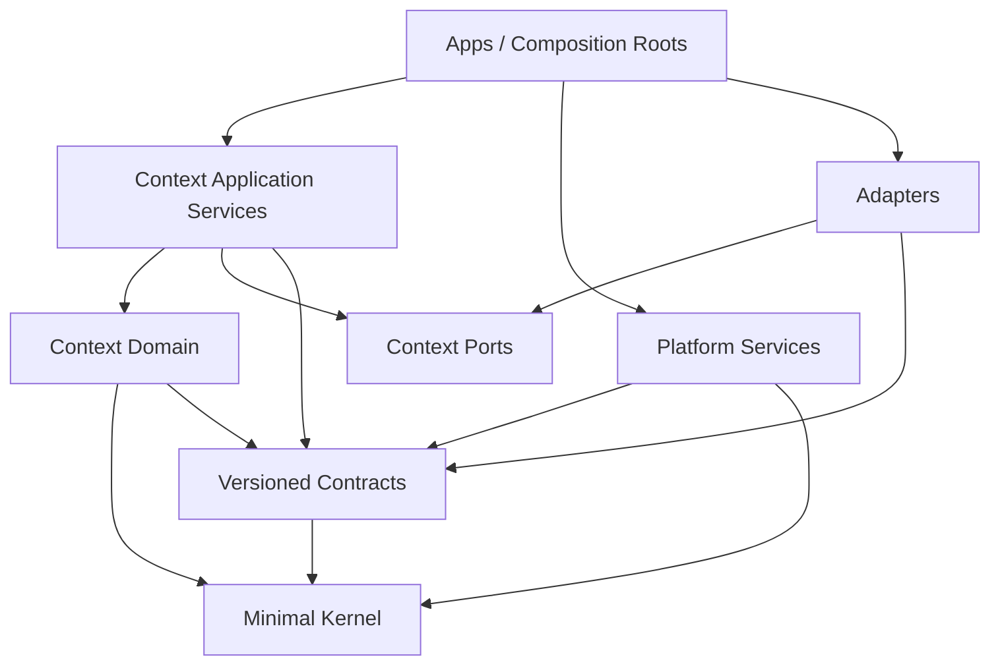
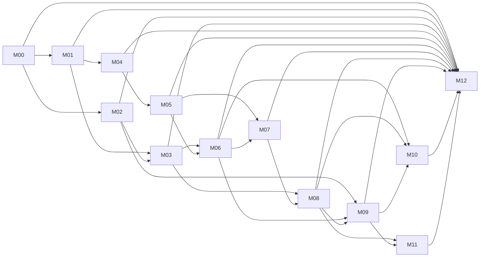
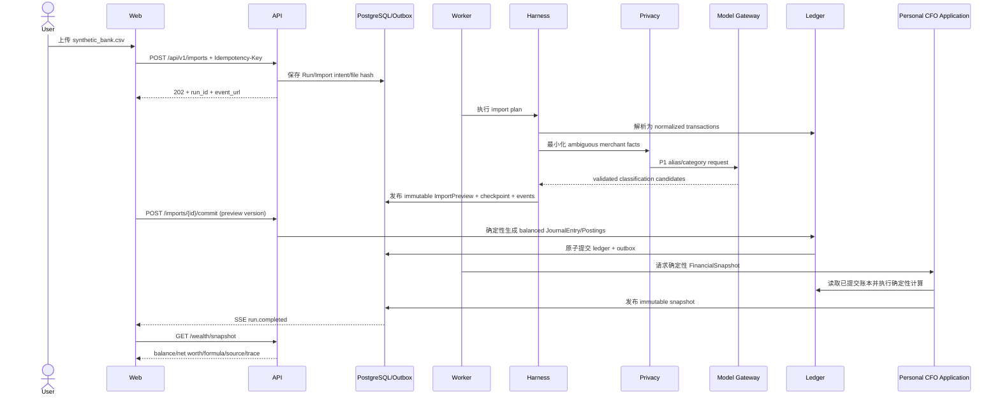

# WealthPilot Engineering Handoff Report

> 文档状态：Engineering Implementation Planning 交付件  
> 架构基线：`Architecture Baseline 1`  
> 架构仓库锚点：`wealthpilot-arch@66085f16bf479018dc0e139262eb283f57945bf3`（`main`）  
> 基线 Tag：当前未创建；Implementation Repository 初始化时必须先记录上述完整 Commit SHA，待 Architect 发布正式 Tag 后补充 Tag，不得仅记录分支名。  
> 建议归档位置：未来 Implementation Repository 的 `docs/engineering/engineering-handoff-report.md`

## 1. Executive Summary

### Readiness 结论

**READY WITH NON-BLOCKING ISSUES**。

Architecture Baseline 1 已经明确产品范围、系统与信任边界、六个领域边界、核心数据所有权、运行时拓扑、Agent Harness 与 Model Gateway 职责、主干 API/Event/Error 语义、安全隐私约束、部署形态、验收场景和 16 周交付顺序。3–5 名工程师可以从 Sprint 0 和 Walking Skeleton 开始，不需要等待架构补写到“完美”。

当前没有阻止 Implementation Repository 初始化、Sprint 0 或首个垂直切片的架构问题。已发现的问题均可通过“先登记、限定影响范围、设定最迟关闭里程碑”的方式继续推进；其中 Live 交易相关问题在第 15 周开始前会升级为该里程碑的阻塞项。

### 主要工程结论

- 使用 monorepo，但按 bounded context 与 deployable application 分离；目录反映 Architecture Baseline，不按框架随意分层。
- 依赖方向固定为 `domain → application ports ← adapters`，应用入口只负责组合；跨领域只通过版本化 Artifact、Command/Query DTO 或 Event，不共享 ORM Entity。
- 第一个 Walking Skeleton 选择“导入一份合成银行流水，生成模型辅助分类的 `ImportPreview`，确认后形成平衡账本与 `FinancialSnapshot`，并在 Web 中可见”。它能在第 1–2 周贯穿 Web、API、Worker、Harness、Model Gateway、Privacy Gate、Artifact、PostgreSQL、Redis/SSE、Trace 和测试，同时不触碰实盘交易。
- 16 周路线保持基线顺序，工程化为 13 个 Milestone（M00–M12）、26 个 Epic、46 个 Work Package；Planner 只能继续拆 Task，不得重新排列硬依赖或改变验收语义。
- 金额、账本、仓位、回测、风险、审批和交易状态全部由确定性代码控制。LLM 只可提出类型化候选、解释确定性结果或生成受约束研究 Artifact。
- Live QMT 是独立安全发布面：未完成契约、隔离、WebAuthn、签名、二次风控和故障门禁，不得启用 Live。

### 最大风险

1. **16 周范围密度**：账本、文档/RAG、投研、回测、交易和自进化均是独立复杂系统。必须守住每周验收的最小闭环，不允许横向铺开后期集成。
2. **契约精度不足**：当前公开契约给出端点和核心字段，但部分请求/响应、Artifact 和交易事件缺少字段级 Schema。必须在实现对应 Work Package 前完成 RFC 决议或兼容性补充。
3. **数据与外部系统不确定性**：授权来源、中文 PDF/OCR 质量、A 股 Point-in-Time 数据和 QMT 行为会直接影响第 6–15 周。
4. **Live 安全边界**：Paper/Live 隔离表述、WebAuthn 生命周期、QMT 协议和取消/未知状态语义尚需冻结。它们不阻塞前 14 周，但阻塞 Live 启用。

## 2. Architecture Readiness

### Readiness Review

| 维度 | 结论 | 已具备的实施依据 | 工程进入条件 / 注意事项 |
|---|---|---|---|
| Product scope | READY | 单用户、本地优先、A 股优先、云模型、逐单人工批准；明确排除多租户、自主实盘、高频和衍生品 | Backlog 不得引入被排除能力 |
| System boundary | READY | Web/API/Harness/领域服务/Model Gateway/QMT 与外部源边界明确 | QMT 保持独立进程与凭据边界 |
| Domain boundary | READY | Wealth、Intelligence、Research、Portfolio/Risk、Trading、Memory/Evolution 六域职责明确 | 跨域禁止直接 ORM/Repository 依赖 |
| Data ownership | READY | PostgreSQL、对象、Qdrant、Trace/Artifact 数据平面和不可变规则明确 | 每张表与迁移必须标注 owning context |
| Runtime topology | READY | Web、API、Worker、Scheduler、Notification、PostgreSQL、Redis、Qdrant、QMT 明确 | Harness/Model Gateway 先作为共享 Python package 运行于 API/Worker，不单独部署 |
| Agent runtime responsibility | READY | Registry、typed handoff、预算、权限、Checkpoint、Trace、Eval 已定义 | Agent 不得直接访问数据库或厂商 SDK |
| Model Gateway responsibility | READY | Provider、路由、隐私、重试、Schema、成本、缓存与审计明确 | 第一个切片必须带 Fake Adapter 和 Provider contract test |
| API contract | READY WITH ISSUE | `/api/v1` 资源与长任务语义明确 | 字段级请求/响应需在各 WP 前冻结，见 `ARCH-ISSUE-002` |
| Event contract | READY WITH ISSUE | Envelope、Run/情报/Agent/审批基础事件明确 | 导入、订单回报和对账事件需扩展，见 `ARCH-ISSUE-003` |
| Error contract | READY | 统一 ErrorResponse、分类、重试和 HTTP 映射明确 | 具体 code 建立受版本控制的 registry |
| Security boundary | READY WITH ISSUE | P0–P3、唯一模型出口、文件不可信、Secret、订单安全明确 | 本机会话与 Live 身份生命周期需冻结，见 `ARCH-ISSUE-007/008` |
| Deployment model | READY WITH ISSUE | Compose 主服务与 Windows Gateway、DEV/DEMO/PAPER/LIVE 明确 | Paper/Live 是否仅 Schema 隔离存在安全歧义，见 `ARCH-ISSUE-006` |
| Testing strategy | READY | Unit/Contract/Integration/Replay/E2E/Security/Fault 及关键阈值明确 | 阈值必须转成机器可读 Gate，而非报告文字 |
| Acceptance traceability | READY | 12 个验收场景覆盖底账、研究、模型故障、安全、交易、自进化 | 每个 WP PR 必须引用场景或说明仅为基础设施 |
| 16-week roadmap | READY | 每周能力、依赖和验收顺序清晰 | 只工程化拆分，不改变周序和能力边界 |

### Ready 项

- 固定产品与安全原则足以建立 architecture tests。
- 关键 Domain Artifact 名称、创建者、消费者、不变量和不可变语义足以建立 schema registry 骨架。
- 双重记账、Point-in-Time、Evidence-first、typed artifacts、人工逐单审批已有 Accepted ADR。
- 验收场景与量化指标足以形成 CI、nightly、milestone 和 Live release gate。
- 16 周路线存在自然的硬依赖链：平台 → 财富底账 → 情报证据 → 投研筛选/回测 → Paper → Evolution → Live → Release。

### Non-blocking issues

- 基线尚无正式 Git Tag；完整 Commit SHA 可先作为不可变锚点。
- API、Event 和部分 Artifact 仍需字段级冻结。
- 市场时序存储、首批 Source Allowlist、对象加密实现尚未唯一化。
- Local Session、WebAuthn 注册/恢复、QMT 线上协议需在对应安全里程碑前决议。
- Paper/Live 隔离要求在不同文档中存在“物理隔离”与“独立 Schema”两种强度表述。

### Blocking issues

**当前无全局 Blocking Issue。**

条件性阻塞规则：`ARCH-ISSUE-003/009` 的 Paper 子集必须在第 13 周前冻结；`ARCH-ISSUE-006` 至 `ARCH-ISSUE-010` 若未在第 15 周开始前全部关闭，则第 15 周 Live/QMT Milestone 判定为 `NOT READY`。系统仍可完成 DEV/DEMO/PAPER 能力，Live 必须保持关闭。

## 3. Proposed Implementation Repository

### Repository tree

```text
wealthpilot/
├── ARCHITECTURE_BASELINE
├── README.md
├── pyproject.toml
├── uv.lock
├── package.json
├── pnpm-lock.yaml
├── pnpm-workspace.yaml
├── apps/
│   ├── api/                    # FastAPI composition root
│   ├── worker/                 # Celery composition root
│   ├── scheduler/              # 定时与补跑策略
│   ├── notification/           # 应用内通知、低敏邮件
│   ├── web/                    # Next.js/PWA、SSE、审批 UI
│   └── qmt-gateway/            # Windows-only 独立发布单元
├── packages/
│   ├── python/
│   │   └── wealthpilot/
│   │       ├── kernel/         # Money、时间、ID、Result 等最小共享核
│   │       ├── contracts/      # Artifact/API/Event/Error 版本化 Schema
│   │       ├── contexts/
│   │       │   ├── wealth/
│   │       │   │   ├── domain/
│   │       │   │   ├── application/
│   │       │   │   ├── ports/
│   │       │   │   └── agents/
│   │       │   ├── intelligence/
│   │       │   ├── research/
│   │       │   ├── portfolio_risk/
│   │       │   ├── trading/
│   │       │   └── evolution/
│   │       ├── platform/
│   │       │   ├── harness/
│   │       │   ├── model_gateway/
│   │       │   ├── privacy/
│   │       │   └── observability/
│   │       └── adapters/
│   │           ├── persistence/
│   │           ├── messaging/
│   │           ├── object_store/
│   │           ├── documents/
│   │           ├── rag/
│   │           ├── sources/
│   │           ├── market_data/
│   │           ├── models/
│   │           ├── broker/
│   │           └── notifications/
│   └── typescript/
│       ├── api-client/         # 从冻结 OpenAPI 生成
│       └── ui/                 # 共享纯展示组件
├── migrations/
│   ├── env.py
│   └── versions/               # 文件名含 owning context
├── evals/
│   ├── datasets/
│   ├── golden/
│   ├── replay/
│   ├── scorers/
│   └── reports/
├── tests/
│   ├── unit/
│   ├── architecture/
│   ├── contract/
│   ├── integration/
│   ├── e2e/
│   ├── security/
│   ├── fault/
│   └── fixtures/synthetic/
├── scripts/                    # 可重复 bootstrap、demo、backup、verify
├── deploy/
│   ├── compose/
│   ├── qmt-windows/
│   └── observability/
├── config/
│   ├── defaults/
│   └── schemas/
├── docs/
│   ├── engineering/
│   ├── runbooks/
│   └── generated/openapi/
└── .github/
    ├── workflows/
    └── CODEOWNERS
```

`ARCHITECTURE_BASELINE` 是机器可读的单一锚点，至少包含 architecture repo URL、完整 Commit SHA、Tag（若有）、记录时间和 contract schema versions。任何基线升级必须单独 PR，并附兼容性与迁移评审。

### Module responsibility and contract map

| 一级模块 | 职责 | 可以依赖 | 禁止依赖 | Architecture/Domain reference | 暴露 contract |
|---|---|---|---|---|---|
| `apps/api` | HTTP/session、命令校验、Query、202/Run ID、SSE 入口 | contracts、context application、platform、adapter wiring | context domain 细节、厂商 SDK、QMT 凭据 | system-context、runtime、api-contracts | OpenAPI `/api/v1`、ErrorResponse |
| `apps/worker` | 文档、研究、回测、报告任务执行 | application、Harness、adapters | Web UI、直接 QMT、绕过 Harness 的模型调用 | runtime、agent-harness | Worker task envelope、Run Event |
| `apps/scheduler` | 计划任务、错过补跑一次、幂等触发 | application command ports、messaging | 领域表直接写入、模型 SDK | PLAN 主动服务、runtime | ScheduledCommand、Run Event |
| `apps/notification` | 应用内通知与低敏邮件 | notification ports、privacy、persistence adapter | P2/P3 原文、领域决策 | runtime、security、UX | Notification DTO |
| `apps/web` | 工作台、上传、Trace、SSE、审批 | generated API client、UI package | 数据库、领域 Python、Secret、Broker | UX、api/event contracts | 浏览器 UI；不创造业务事实 |
| `apps/qmt-gateway` | Windows 账户/行情/订单、二次风控、对账、Kill Switch | 独立 qmt contracts、xtquant adapter、安全组件 | Agent、Model Gateway、主库凭据 | deployment、trading、ADR-0006 | mTLS QMT protocol、signed envelope、status events |
| `kernel` | Money、UTC time、ID、schema version、基础错误值 | 标准库、Pydantic 最小集合 | 任一 context、数据库、框架 | data-architecture、domain-artifacts | 稳定值对象；不含业务流程 |
| `contracts` | 跨进程/跨域 Artifact、API/Event/Error Schema | kernel | domain entity、ORM、adapter | contracts/*、ADR-0004 | versioned public schemas |
| `contexts/wealth` | 账本、资产负债、目标、IPS、财务计算与相关 Agent | kernel、contracts、own ports、deterministic libs | 其他 context internals、adapters、模型 SDK | wealth-management、ADR-0002 | FinancialSnapshot、IPS、ImportPreview 等 |
| `contexts/intelligence` | 来源、Coverage、文档生命周期、Evidence、DSL | kernel、contracts、own ports | Research/Trading internals、模型 SDK、DB | financial-intelligence、ADR-0003/0005 | CoverageManifest、EvidenceFact、ResearchSnapshot inputs |
| `contexts/research` | Plan、专业 Agent、Bull/Bear、Audit、Memo、Screener coordination | kernel、contracts、own ports、Harness facade | DB、source/vendor SDK、Trading internals | equity-research、ADR-0003/4/5 | ResearchPlan、reports、DecisionMemo、ScreeningSpec |
| `contexts/portfolio_risk` | 组合、回测、仓位、硬风控、再平衡 | kernel、contracts、own ports | Agent 自报数字、Broker SDK、模型 SDK | portfolio-risk、testing | PortfolioSnapshot、RiskAssessment、Backtest result |
| `contexts/trading` | Proposal、审批、Paper、Broker orchestration、对账 | kernel、contracts、risk contract、own ports | Research internals、Broker 凭据、直接模型调用 | trading-execution、ADR-0006 | OrderProposal、Approval、Execution events |
| `contexts/evolution` | 记忆、归因、候选、评测、批准、回滚 | contracts、own ports、eval facade | 风控/审批/Secret/发布策略修改 | memory-evolution | EvolutionCandidate、Attribution |
| `platform/harness` | Agent/Tool Registry、DAG、预算、Checkpoint、权限、Trace | kernel、contracts、privacy/model-gateway ports | context ORM、Broker SDK | agent-harness、ADR-0004 | Run/Task service、Tool facade、Checkpoint |
| `platform/model_gateway` | Provider 路由、隐私、Schema、成本、可靠性 | contracts、privacy、model adapter ports、observability | 业务 domain、厂商 SDK（SDK 仅 adapter 内） | model-gateway、ADR-0001 | ModelRequest/ModelResponse |
| `platform/privacy` | P0–P3 分类、最小化、日志红线 | kernel、config | 业务决策、外发网络 | security-privacy、ADR-0001 | PrivacyDecision、redaction result |
| `platform/observability` | Log/metric/trace 安全封装 | kernel、privacy | 业务写入、P2/P3 payload | runtime、security | TraceSpan、safe audit event |
| `adapters/*` | 实现 ports：SQL、Redis、对象、文档、RAG、来源、模型、Broker | 对应 ports/contracts、必要厂商库 | 反向驱动 domain、跨 context 业务调用 | data/deployment/runtime | port implementation；不成为跨域 API |
| `migrations` | 版本化数据库变更与回滚/验证 | schema metadata、migration tooling | 业务运行逻辑 | data/deployment | migration revision graph |
| `evals` | 固定数据集、replay、scorer、报告 | public contracts、test facades | 生产 Secret、真实个人数据 | testing-evaluation | EvaluationResult、baseline report |
| `tests` | 分层验证与发布证据 | public APIs/test hooks | 真实 Broker/真实个人数据默认调用 | acceptance/testing/security | JUnit、coverage、eval reports |

### Dependency rules



箭头表示“可以编译依赖”。Adapters 实现 Ports，由 Apps 组合注入；Domain 永远不知道 Adapter。为避免图中误解，`application → ports ← adapters` 是控制反转关系，运行时控制流可以从 Application 调用 Adapter，但源代码依赖不反向。

#### Allowed dependency

- 同一 context 的 `application` 可依赖本域 `domain`、`ports` 与公共 `contracts`。
- Adapter 只依赖它实现的 port、必要 contract 和 vendor library。
- Harness 通过注册的 Tool/Agent contracts 调用 context application facade，不导入 context repository。
- Research 使用 `FinancialSnapshot`、`ResearchSnapshot`、`RiskAssessment` 等已发布 contract，不导入 Wealth/Intelligence/Risk 的 entity。
- Trading 只接收不可变 `DecisionMemo` 引用和已发布 `RiskAssessment`，不读取研究内部表。
- Web 只依赖生成的 OpenAPI client 和 Event schema。

#### Forbidden dependency

- Domain → FastAPI/Celery/SQLAlchemy/Redis/Qdrant/LangGraph/vendor SDK。
- Agent → database session/repository/vendor model SDK/Broker SDK。
- 一个 context → 另一个 context 的 `domain`、`application`、ORM model 或 migration。
- Model Gateway → 业务 context；QMT Gateway → Harness/Agent/主应用数据库。
- UI → 数据库或自行重算金额/风控。
- Evolution → risk limit、approval、Broker permission、Secret、Live switch 或发布流程。
- 任何路径绕过 Approval Service 将 Live Proposal 送入 QMT transport。

#### Cross-domain communication

- 同进程强一致调用：使用版本化 Command/Query DTO + application facade，仅用于立即需要结果且无外部副作用的操作。
- 异步与跨进程：使用 Outbox 写入版本化 Event；consumer inbox 按 `event_id` 幂等。
- 长任务：以 `run_id`、Artifact ID 和 Checkpoint 串联，不传递自由文本作为唯一协议。
- 跨域读取：优先查询已发布 Snapshot/Artifact；禁止跨域 join 私有表。确有读取模型需求时建立显式 read model，由 owning context 发布。
- 外部副作用：先写 Intent + idempotency key，再调用 Adapter；未知状态转查询/对账，不自动重放。

#### Shared kernel principles

`kernel` 只允许 Money、Currency、UTC/as-of/available-at 时间类型、ID、schema version、hash、通用 Result 等真正稳定且无领域所有权的值对象。禁止放入 `User`、`Account`、`Security`、`Order`、`Document`、`Run` 聚合或“通用 service”。新增 shared-kernel 类型需要至少两个 context 的明确消费者、architecture owner review 和向后兼容测试。

#### Contract boundary and drift prevention

- Public contract 采用 schema-first：Pydantic/JSON Schema 为 Python 权威源，生成 OpenAPI 和 TypeScript client；事件 Schema 单独版本化。
- `import-linter`/自定义 AST architecture tests 阻断 forbidden imports；`ruff`、`pyright --strict`、`mypy`（如选用其一则全仓一致）执行静态检查。
- 数据表、migration、event consumer 和 CODEOWNERS 都标注 owning context。
- Contract change 必须附兼容性报告、consumer contract test、schema version 说明；破坏性变更需要 Architecture RFC。
- CI 对 `ARCHITECTURE_BASELINE`、contract snapshot、OpenAPI diff、migration heads、Event registry 和 dependency graph 做漂移检测。
- 每个 Milestone 结束生成 architecture conformance report；禁止用临时跨域 import 解决排期压力。

## 4. Engineering Milestones

下表不重排 `docs/delivery/implementation-roadmap.md`；一个 Milestone 的 Exit Criteria 未通过时，依赖它的能力不得宣称完成。允许后续团队提前做隔离 PoC，但不得提前合入会改变公开契约或绕过 Gate 的生产路径。

| Milestone | 周期 | Goal / User-visible capability | Engineering scope / Main components | Dependencies | Exit criteria | Required tests / evals | Architecture references | Main risks |
|---|---:|---|---|---|---|---|---|---|
| M00 Engineering Foundation | W1 | 一条命令启动基础服务；看到健康状态与安全 Trace | Monorepo、Compose、CI、kernel/contracts、DB/Redis/Qdrant、migration、observability | Baseline commit | 全新环境 bootstrap；迁移/测试重复执行；合成与真实路径隔离 | Unit、architecture、migration、secret/privacy smoke | roadmap W1；runtime；data；security | Sprint 0 膨胀、共享核过大 |
| M01 Gateway, Harness & Walking Skeleton | W2 | 导入任务 2 秒内返回 Run ID，进度可恢复，生成可见 ImportPreview | Model Gateway、Privacy Gate、Harness、Celery、Checkpoint、SSE、首个 vertical slice | M00；`ARCH-ISSUE-002` 的最小 Import/Run Schema Addendum | Fake Provider 与故障恢复；非法 schema 阻断；P2/P3 零泄漏；Walking Skeleton E2E 通过 | Contract、integration、E2E、fault、privacy fixtures | roadmap W2；agent-harness；model-gateway；ADR-0001/4 | 异步一致性、隐私红线 |
| M02 Ledger & Personal Assets | W3–4 | 导入一年合成数据并得到准确资产负债、现金流和预算 | Ledger、ImportBatch、parsers、dedupe、reversal、reconciliation、wealth UI | M00；复用 M01 async pattern | 借贷 100% 平衡；重复导入零新增；转账不计收入/支出 | Golden、property、parser contract、E2E | roadmap W3–4；wealth；ADR-0002；AS-1 | Parser 长尾、错误分类 |
| M03 Financial Planning | W5 | 创建目标和 IPS，得到资金缺口、储蓄计划与可投资上限 | Goal、loan、insurance、Monte Carlo、IPS、CFO/Planner/Allocation | M02；M01 | AS-2 通过；缺输入不输出默认金额；IPS 版本不可覆盖 | Deterministic golden、scenario、agent schema eval | roadmap W5；wealth；artifacts；AS-2 | 概率假设、Agent 越权计算 |
| M04 Financial Intelligence | W6–7 | 研究标的时自动补齐、验证、解析并展示资料覆盖度 | Source Registry、authorization、object store、versioning、Docling/OCR、Coverage、document UI | M00/M01；`ARCH-ISSUE-004/005` 关闭或限定 | AS-3/4；重复/修订正确；低质量显式失败 | Source contract、document fixtures、security sandbox、integration | roadmap W6–7；intelligence；security；AS-3/4/9 | 来源授权、OCR、恶意文件 |
| M05 Evidence, RAG & Finance DSL | W8 | 跨文档回答可跳到原文并复算公式 | Dense/Sparse/RRF/Rerank、Evidence Ledger、conflict、highlight、DSL | M04 | AS-5；Recall@10≥90%；页码/单位/期间≥95%；Tool injection=0 | Retrieval eval、DSL golden、prompt injection、E2E | roadmap W8；intelligence；ADR-0003；AS-5/7/9 | 评测集代表性、解析误差传播 |
| M06 Auditable Equity Research | W9–10 | 生成含反方证据、失效条件和个人适配性的 Decision Memo | Plan/Snapshot、specialist agents、Bull/Bear、Audit、Risk、Memo、Trace UI | M03 + M05 + M01 | AS-7/8；重要主张覆盖≥95%；无证据高置信主张=0 | Agent replay/golden、schema、fault、risk integration | roadmap W9–10；research；ADR-0003/4/5 | Agent 质量/成本、跨域集成 |
| M07 Screening & Peer Comparison | W11 | 自然语言条件预览后确定性筛选，Top-K 才进入研究 | ScreeningSpec、registry、validator、query engine、ranking、peer matrix | M05/M06；Point-in-Time data | AS-6；与人工 Spec 一致 100%；非法字段拒绝 | Golden、query differential、PIT/leakage | roadmap W11；research；artifacts；AS-6 | 数据字段覆盖、SQL 安全 |
| M08 Backtest & Portfolio Risk | W12 | 查看回测、组合风险、再平衡与受约束仓位 | Event backtest、A-share rules、walk-forward、PIT、risk/position | M03 + M07；`ARCH-ISSUE-004` 关闭 | future leakage=0；Golden 稳定；缺输入时阻断 | Unit/property、golden、walk-forward、leakage | roadmap W12；portfolio-risk；ADR-0005 | 市场规则细节、性能 |
| M09 Paper Trading & Proactive Service | W13 | 用户确认模拟订单，完成成交/持仓/账本对账；收到无重复通知 | Proposal/state machine、Paper broker、fills/reconciliation、scheduler、monitor、notification | M02/M03/M06/M08；event extension | AS-10 Paper；完整闭环；补跑一次；通知去重；邮件低敏 | State machine、contract、E2E、fault、privacy | roadmap W13；trading；UX；AS-10/11 | 账本对账、事件幂等 |
| M10 Memory & Controlled Evolution | W14 | 用户纠正生成候选，审批前不生效，可灰度回滚 | Four memories、attribution、failure classification、candidate、eval、registry | M06/M08/M09；Eval Harness | AS-12；单变量；安全失败不可批；rollback 恢复 | Replay、walk-forward、security/cost regression、E2E | roadmap W14；memory-evolution；AS-12 | 评价归因错误、污染生产 |
| M11 Human-approved QMT Live | W15 | 有效逐单批准后才可提交 Live；故障不重复下单 | WebAuthn、Ed25519、mTLS、Gateway、secondary risk、recon、Kill Switch | M09；M08；`ARCH-ISSUE-006..010` 全部关闭 | 未批准订单=0；重复订单=0；UNKNOWN 不重发；修改 Proposal 批准失效 | Security、protocol contract、fault injection、negative E2E | roadmap W15；trading；security；ADR-0006；AS-10/11 | 最高安全风险、Windows/QMT 差异 |
| M12 Stabilization & Public Delivery | W16 | 全新环境一键 Demo，完成 10 分钟端到端演示 | Fault/perf/security/soak、synthetic dataset、docs、eval report、demo packaging | M00–M11；Live 可在问题未关闭时明确排除并保持 off | 最终脚本通过；Secret Scan=0；全新环境启动；交付报告可复现 | Full regression、fault、perf、security、demo E2E | roadmap W16；demo-deliverables；testing | 最后集成、环境不可复现 |

### Milestone dependency DAG



## 5. Work Packages

表中 `AS-n` 指 `docs/product/acceptance-scenarios.md` 的场景编号。每个 Work Package 的 Output 是被后续任务消费的正式交付，不是临时 PoC。

### Epic map

| Milestone | Epic | Goal | Work Packages |
|---|---|---|---|
| M00 | E00-A Repository & Runtime Foundation | 建立可复现仓库、contract/kernel 与本地运行时 | WP-0001..0003 |
| M00 | E00-B Quality Foundation | 用自动化阻止质量、安全和架构漂移 | WP-0004 |
| M01 | E01-A Safe Model Boundary | 建立统一模型出口与 P0–P3 Gate | WP-0101..0102 |
| M01 | E01-B Recoverable Agent Runtime | 建立 Harness 并完成第一个垂直切片 | WP-0103..0104 |
| M02 | E02-A Auditable Ledger | 完成导入、平衡、幂等与对账底座 | WP-0201..0203 |
| M02 | E02-B Personal Wealth View | 从底账生成可解释的财富视图 | WP-0204 |
| M03 | E03-A Deterministic Financial Planning | 完成目标、贷款、保险、IPS 与可投资资金计算 | WP-0301..0302 |
| M03 | E03-B Planning Agent Experience | 用 Agent 解释确定性计划并形成 typed outputs | WP-0303 |
| M04 | E04-A Authorized Document Acquisition | 完成来源授权、安全对象与版本生命周期 | WP-0401..0402 |
| M04 | E04-B Parsed Coverage Experience | 完成解析/OCR、Coverage 和文档进度 UI | WP-0403..0404 |
| M05 | E05-A Evidence Retrieval Platform | 完成 Hybrid RAG、Evidence 与冲突基础 | WP-0501..0502 |
| M05 | E05-B Reproducible Financial Reasoning | 通过 DSL 与原文定位交付跨文档计算 | WP-0503 |
| M06 | E06-A Snapshot-bound Research Team | 冻结研究输入并并行生成专业报告 | WP-0601..0602 |
| M06 | E06-B Audited Investment Decision | 完成 Bull/Bear、Evidence Audit、Risk 与 Memo | WP-0603..0604 |
| M07 | E07-A Deterministic Screening | 解释、校验并执行 Point-in-Time ScreeningSpec | WP-0701..0702 |
| M07 | E07-B Comparable Peer Analysis | 交付口径对齐的同行比较 | WP-0703 |
| M08 | E08-A Point-in-Time Backtesting | 交付 A 股回测与 Walk-forward analytics | WP-0801..0802 |
| M08 | E08-B Portfolio Risk & Positioning | 交付组合风险、仓位与再平衡 | WP-0803 |
| M09 | E09-A Paper Execution Loop | 交付 Proposal、Paper 成交与账本对账 | WP-0901..0902 |
| M09 | E09-B Proactive Wealth Service | 交付幂等计划任务、通知与低敏邮件 | WP-0903..0904 |
| M10 | E10-A Memory & Improvement Candidate | 交付记忆、归因、失败分类与单变量候选 | WP-1001..1002 |
| M10 | E10-B Controlled Rollout | 交付评测、批准、灰度与回滚 | WP-1003 |
| M11 | E11-A Live Security Boundary | 交付身份、密码信封与隔离 QMT Gateway | WP-1101..1102 |
| M11 | E11-B Live Reconciliation & Certification | 交付 Live 编排、对账与负面故障认证 | WP-1103..1104 |
| M12 | E12-A Stabilized Release Candidate | 完成全量回归、故障、安全、性能和 soak | WP-1201 |
| M12 | E12-B Reproducible Public Delivery | 完成一键 Demo、证据报告与公开材料 | WP-1202..1203 |

### M00 — W1 Engineering Foundation

| ID | Name / Goal | Inputs | Outputs | Dependencies | Architecture Reference | Acceptance Criteria |
|---|---|---|---|---|---|---|
| WP-0001 | Repository & baseline bootstrap：建立可复现 monorepo | Baseline commit、技术栈 | repo manifests、`ARCHITECTURE_BASELINE`、`uv`/`pnpm` lock、CODEOWNERS | 无 | PLAN §9/14；roadmap W1 | 全新 clone 可校验 baseline；Python 3.12/Node 版本固定；无生产代码写回 arch repo |
| WP-0002 | Kernel & contract registry：建立最小公共类型 | Money/time/schema rules、Artifact/Event/Error contracts | `kernel`、contract packages、schema registry、TS generation pipeline | WP-0001 | domain-artifacts；event/error contracts；ADR-0004 | Decimal string/UTC round-trip；非法 schema 被拒；contract snapshot 可 diff |
| WP-0003 | Local runtime & persistence baseline：一键启动基础设施 | deployment/data docs | Compose、Postgres/Redis/Qdrant、Alembic、synthetic data roots | WP-0001 | runtime；data；deployment | 一条命令启动；迁移 upgrade 可重复；DEV/DEMO 路径与真实数据目录隔离 |
| WP-0004 | CI, quality & safe observability baseline | testing/security、dependency rules | lint/format/type/unit/architecture/secret scan、OTel/log redaction | WP-0001/2 | testing；security；agent-harness Trace | PR Gate 全绿；P2/P3 fixture 不入日志；forbidden import test 能真实失败 |

### M01 — W2 Model Gateway, Harness & Walking Skeleton

| ID | Name / Goal | Inputs | Outputs | Dependencies | Architecture Reference | Acceptance Criteria |
|---|---|---|---|---|---|---|
| WP-0101 | Model Gateway core：统一模型出口 | ModelRequest、routing/privacy rules | provider port、Fake/OpenAI-compatible adapters、routing、schema/cost/timeout | WP-0002/4 | model-gateway；ADR-0001 | 业务包无 vendor SDK import；invalid structured response 不下游；成本与版本可见 |
| WP-0102 | Privacy Gate：实现 P0–P3 最小化与拒绝 | security fixtures | classifier/redactor/minimizer、safe audit summary | WP-0002/4 | security；ADR-0001 | P2 原文与 P3 字段外发/日志数量均为 0；无法脱敏时显式失败 |
| WP-0103 | Harness core：Run/Task/Artifact/Tool/Checkpoint | RunState、Artifact contracts | registry、budget、permission、retry/timeout、checkpoint/replay、trace | WP-0002/3/4 | agent-harness；ADR-0004 | 超时/预算/非法 Artifact 安全终止；重启从 checkpoint 恢复；副作用幂等 |
| WP-0104 | Async API, Worker, SSE & Walking Skeleton | WP-0101/2/3、approved minimal Import/Run Schema、synthetic CSV | `POST /imports` vertical slice、Celery task、SSE reconnect、minimal Web UI | WP-0101/2/3；ARCH-ISSUE-002 minimal addendum | runtime；UX；api/event contracts | 2 秒内 `202 + run_id`/首事件；断线续传；完整成功标准见 §6 |

### M02 — W3–4 Ledger & Personal Assets

| ID | Name / Goal | Inputs | Outputs | Dependencies | Architecture Reference | Acceptance Criteria |
|---|---|---|---|---|---|---|
| WP-0201 | Double-entry ledger core：建立不可漂移底账 | Money、ADR-0002 | Account/JournalEntry/Posting、balance invariant、reversal | WP-0002/3 | wealth；ADR-0002 | Property tests 与 Golden Ledger 100% 平衡；已提交项不可原地改 |
| WP-0202 | Import adapters & preview：覆盖首批合成来源 | source file fixtures、ImportBatch | 支付宝/微信/银行/信用卡/QMT parsers、mapping、preview | WP-0104/0201 | wealth import flow；AS-1 | 所有 baseline fixtures 解析；新增/跳过/冲突/待确认可见；文件安全校验生效 |
| WP-0203 | Commit, dedupe, transfer/refund & reconciliation | confirmed preview、source hashes | idempotent commit、transfer/refund/installment rules、reconciliation | WP-0201/2 | wealth；ADR-0002；AS-1 | 重复文件/记录零重复 Posting；转账不影响净收入；差异显式报告 |
| WP-0204 | Wealth read models & UI：可见资产负债/现金流/预算 | ledger、valuations | FinancialSnapshot、cashflow/budget queries、dashboard/import UI | WP-0203 | product UX；domain-artifacts；AS-1 | 一年合成数据净资产/余额/收支与 oracle 一致；公式与来源可下钻 |

### M03 — W5 Financial Planning

| ID | Name / Goal | Inputs | Outputs | Dependencies | Architecture Reference | Acceptance Criteria |
|---|---|---|---|---|---|---|
| WP-0301 | Deterministic planning engine：所有金额可复算 | FinancialSnapshot、goal/loan fixtures | emergency/loan/insurance/NPV/IRR/XIRR/Monte Carlo/investable capital | WP-0204 | wealth deterministic engine；testing | Golden 100%；Decimal 无 float；随机模拟固定 seed/version 可重现 |
| WP-0302 | Goal & IPS lifecycle：目标先于证券资金 | planning results、IPS contract | versioned Goal/IPS、conflict report、scenario APIs/UI | WP-0301 | wealth；domain-artifacts；AS-2 | 目标资金先保留；旧 IPS 只读；缺输入产生阻断/质量状态 |
| WP-0303 | CFO/Planner/Allocation agent slice：解释而不改数值 | deterministic artifacts、Model Gateway | typed Agent outputs、evidence/trace、financial plan UI | WP-0103 + WP-0301/2 | PLAN agents；agent-harness；AS-2 | Agent 输出金额逐项匹配 engine；工具权限最小；模型失败保留确定性结果 |

### M04 — W6–7 Financial Intelligence

| ID | Name / Goal | Inputs | Outputs | Dependencies | Architecture Reference | Acceptance Criteria |
|---|---|---|---|---|---|---|
| WP-0401 | Source Registry & authorization：只访问允许来源 | Source policy/RFC、DocumentRequirement | source contracts、allowlist、rate/cache/retry、discovery | WP-0103；ARCH-ISSUE-005 | intelligence；system external deps | 未授权正文不下载；adapter contract tests；来源/发布时间/授权可审计 |
| WP-0402 | Secure object & document lifecycle：版本不可覆盖 | file security、storage decision | quarantine、hash、encrypted object、Document/Version state machine | WP-0003；ARCH-ISSUE-004 | security；data；intelligence | 恶意类型/压缩炸弹拒绝；SHA 去重 100%；修订产生新版本；旧引用有效 |
| WP-0403 | Parsing/OCR & structured blocks：低质量显式失败 | native/scanned/table fixtures | Docling/PaddleOCR adapters、Block/Table/Cell、quality report | WP-0402 | intelligence parsing；AS-3/4/9 | 原生/扫描/跨页表格 fixture 通过；页码/bbox 保留；低质量返回 contract error |
| WP-0404 | Coverage orchestration & document UI | requirements、registry、parsed docs | CoverageManifest、download/parse/index progress、three-column minimal UI | WP-0401/2/3 | domain-artifacts；UX；AS-3/4 | Requirement 唯一归类；缺失不静默；新研究用修订版、历史 snapshot 保持旧版 |

### M05 — W8 Evidence, RAG & Finance DSL

| ID | Name / Goal | Inputs | Outputs | Dependencies | Architecture Reference | Acceptance Criteria |
|---|---|---|---|---|---|---|
| WP-0501 | Hybrid retrieval & context hierarchy | parsed blocks、Qdrant/Postgres | metadata filter、Dense/Sparse、RRF、rerank、4-level context | WP-0403/4 | intelligence retrieval；agent-harness compression | Recall@10≥90%；最多三轮且由缺失类型驱动；token 降≥50%、质量降≤2pp |
| WP-0502 | Evidence Ledger & conflict/audit foundation | retrieval candidates、market facts | EvidenceFact append-only、consolidation、conflict、highlight | WP-0501 | ADR-0003；domain-artifacts | 页码/单位/期间准确≥95%；来源可定位；置信度不使用模型自报概率 |
| WP-0503 | Finance DSL & cross-document E2E | EvidenceFact、allowed operations | validated plans、interpreter、calculation chain、comparison UI | WP-0502 | intelligence DSL；AS-5/7/9 | 禁止 eval/exec；公式/中间值/舍入可复算；Prompt Injection ToolCall=0 |

### M06 — W9–10 Auditable Equity Research

| ID | Name / Goal | Inputs | Outputs | Dependencies | Architecture Reference | Acceptance Criteria |
|---|---|---|---|---|---|---|
| WP-0601 | ResearchPlan, Coverage gate & immutable Snapshot | user intent、Coverage、PIT data | ResearchPlan、Data Steward validation、ResearchSnapshot | WP-0302 + WP-0404/0502 | research；ADR-0005 | Snapshot 全引用存在/不可变/当时可用；Coverage 未满足时警告或停止 |
| WP-0602 | Specialist agents：并行生成可审计报告 | Snapshot、Harness、Evidence | Fundamental/Valuation/Industry/Quant/News-Macro artifacts | WP-0601 + WP-0103 | research parallel analysis；ADR-0004 | 所有 output schema 有 contract test；事实引用 Evidence；计算调用 deterministic tool |
| WP-0603 | Bull/Bear, Evidence Audit & contradiction loop | specialist artifacts、Evidence | BullCase/BearCase、一次补充调查、ContradictionMatrix、EvidenceAudit | WP-0602 + WP-0502 | research；AS-7 | 每实质主张≥1 Evidence；各质询三项；不支持引用不能进入高置信结论 |
| WP-0604 | Risk-aware Decision Memo & Trace UI | audited research、FinancialSnapshot、IPS、PortfolioSnapshot | RiskAssessment、DecisionMemo、independent critic、research UI | WP-0303 + WP-0603 | artifacts；model-gateway；AS-7/8 | 重要主张覆盖≥95%；仓位来自 Risk Engine；第二 Provider 缺失时显示规定警告 |

### M07 — W11 Screening & Peer Comparison

| ID | Name / Goal | Inputs | Outputs | Dependencies | Architecture Reference | Acceptance Criteria |
|---|---|---|---|---|---|---|
| WP-0701 | Screening interpreter & registry：自然语言只生成 Spec | user conditions、field registry | ScreeningSpec、explanation、validator、missing policy | WP-0101 + WP-0502 | research screening；domain-artifacts | Golden cases；未注册字段/operator/window/event 拒绝；LLM 文本不作 SQL |
| WP-0702 | Deterministic PIT screener & Top-K orchestration | validated Spec、PIT universe/data | parameterized engine、filters、ranking、saved results、Top-K Run | WP-0701 + WP-0601 | AS-6；ADR-0005 | 与人工 Spec 结果一致 100%；`research_top_k<=max`；未来数据泄漏=0 |
| WP-0703 | Peer selection & comparison matrix | industry/size/revenue data、Evidence、DSL | peer policy、normalized metrics、NOT_COMPARABLE、comparison UI | WP-0503 + WP-0702 | equity-research peer comparison | 期间/币种/单位/口径对齐；不可比不填默认值；结果引用 facts/formulas |

### M08 — W12 Backtest & Portfolio Risk

| ID | Name / Goal | Inputs | Outputs | Dependencies | Architecture Reference | Acceptance Criteria |
|---|---|---|---|---|---|---|
| WP-0801 | A-share event-driven backtest | PIT market/corporate actions、strategy spec | engine、T+1/limit/suspension/fees/slippage/actions | WP-0702；ARCH-ISSUE-004 | portfolio-risk；ADR-0005 | Golden strategy stable；所有 market rules fixtures 通过；future leakage=0 |
| WP-0802 | Walk-forward & performance analytics | backtest events/results | splits、metrics、benchmark/industry/factor/stability reports | WP-0801 | portfolio-risk；testing | 历史 universe；参数稳定性可复现；结果绑定 Snapshot/version |
| WP-0803 | Portfolio risk, target position & rebalance | FinancialSnapshot/IPS/PortfolioSnapshot/market | exposures、RiskAssessment、deterministic min position、rebalance UI | WP-0302 + WP-0801/2 | portfolio-risk；AS-2 | 风控 Golden 100%；任何必要输入缺失都阻断具体仓位；前后暴露/成本可见 |

### M09 — W13 Paper Trading & Proactive Service

| ID | Name / Goal | Inputs | Outputs | Dependencies | Architecture Reference | Acceptance Criteria |
|---|---|---|---|---|---|---|
| WP-0901 | OrderProposal & deterministic state machine | DecisionMemo、RiskAssessment | immutable limit Proposal、approval/reject/expiry/state transitions | WP-0604 + WP-0803；ARCH-ISSUE-003/009 Paper subset | trading；domain-artifacts | 变更字段生成新 Proposal；非法 transition 拒绝；风控失败无 Proposal |
| WP-0902 | Paper Broker, fills & ledger reconciliation | approved Paper Proposal、market simulator | order/fill events、Paper account、holding lots、cash ledger recon | WP-0201 + WP-0901 | trading；ADR-0002；AS-10/11 | Paper E2E；重复请求零重复单；UNKNOWN 查询不重发；成交进入同一账本 |
| WP-0903 | Scheduler, monitoring & idempotent notification | holdings、memo invalidation、calendar | daily/weekly/monthly/event jobs、missed-run-once、in-app notices | WP-0103 + WP-0604/0902 | PLAN active service；UX | 错过仅补一次；重复 event 无重复通知；应用内内容完整 |
| WP-0904 | Low-sensitive email & proactive E2E | notification artifacts、privacy | SMTP adapter、summary template、local app link、runbooks | WP-0903 + WP-0102 | system-context；security；demo | 邮件无 P2/P3；失败不丢应用内通知；AS-10 Paper 全链路回归 |

### M10 — W14 Memory & Controlled Evolution

| ID | Name / Goal | Inputs | Outputs | Dependencies | Architecture Reference | Acceptance Criteria |
|---|---|---|---|---|---|---|
| WP-1001 | Versioned memory & attribution | runs、research、trades、feedback | semantic/episodic/procedural/evidence memories、attribution | WP-0604 + WP-0902 | memory-evolution | 过期/撤销记忆不入上下文；归因不仅以涨跌判断；全部绑定来源/version |
| WP-1002 | Failure classification & candidate generation | traces、attribution、user correction | root cause、single-variable EvolutionCandidate、baseline metrics | WP-1001 + eval infrastructure | memory-evolution；domain-artifacts | 一次只改一个 target_type；禁止对象无法创建候选；candidate 可审计 |
| WP-1003 | Champion–Challenger approval, rollout & rollback | candidate、replay/walk-forward/security/cost results | approval UI、version registry、canary、automatic rollback | WP-1002 + WP-0802 | memory-evolution；AS-12 | 未批准版本不生效；任一安全/隐私回归不可批；rollback 恢复 Champion |

### M11 — W15 Human-approved QMT Live

| ID | Name / Goal | Inputs | Outputs | Dependencies | Architecture Reference | Acceptance Criteria |
|---|---|---|---|---|---|---|
| WP-1101 | Live identity & cryptographic envelope | resolved auth RFC、Proposal hash | WebAuthn lifecycle、Ed25519 keys、mTLS、nonce/expiry/idempotency | WP-0901；ARCH-ISSUE-006/7/8/9/10 closed | security；ADR-0006 | 任一字段变化批准/签名失效；replay/expired/invalid cert 全拒绝；Secret 不入主库 |
| WP-1102 | Windows QMT Gateway & secondary risk | signed envelope、xtquant contract | isolated service、account/position/market/order/cancel/query、Kill Switch | WP-1101 + WP-0803 | deployment；trading | Gateway 无 Agent/model；启动默认交易关闭；二次风控失败零提交 |
| WP-1103 | Live broker orchestration & reconciliation | Gateway protocol、approval、proposal | main Broker adapter、status/fill/recon events、read-only degrade | WP-0902 + WP-1102 | runtime order sequence；AS-10/11 | 无有效逐单批准 Gateway 收单=0；UNKNOWN 不重发；差异暂停新单并告警 |
| WP-1104 | Live negative/fault certification | test account/fake xtquant、fault matrix | protocol/security/fault report、operator runbook、go-live checklist | WP-1103 | testing trading/security；ADR-0006 | 断网/重复/重启零重复单；Kill Switch/撤单/查询可用；未过 Gate Live 保持 off |

### M12 — W16 Stabilization & Public Delivery

| ID | Name / Goal | Inputs | Outputs | Dependencies | Architecture Reference | Acceptance Criteria |
|---|---|---|---|---|---|---|
| WP-1201 | Full regression, fault, security, performance & soak | all services、failure matrix | regression/fault/security/perf/soak reports、fixed release candidate | M00–M11 | testing-evaluation；roadmap W16 | 基线阈值全达标；复杂任务首事件<2s；所有阻断级缺陷关闭或 Live 明确禁用 |
| WP-1202 | Reproducible synthetic demo & one-command launch | demo datasets、release candidate | seeded data、Compose/demo scripts、10-minute E2E、backup/restore proof | WP-1201 | demo-deliverables；AS-1..12 | 全新环境一键启动；全演示不依赖真实账户/私有数据；每结论/计算可追溯 |
| WP-1203 | Public delivery evidence | generated OpenAPI、eval/security reports、runbooks | README、architecture/security/eval docs、video inputs、release manifest | WP-1202 | demo-deliverables；security public repo | Secret Scan=0；baseline SHA 与依赖版本可见；文档与实际行为/指标一致 |

### Acceptance traceability summary

| Acceptance scenario | Primary Work Packages | Release evidence |
|---|---|---|
| AS-1 建立资产负债表 | WP-0201..0204 | Golden Ledger + import E2E |
| AS-2 评估投资能力 | WP-0301..0303、WP-0803 | scenario test + risk proof |
| AS-3 自动补齐资料 | WP-0401..0404 | source/document E2E |
| AS-4 修订与历史研究 | WP-0402/4、WP-0601 | version/PIT replay |
| AS-5 跨文档数值推理 | WP-0501..0503 | RAG eval + DSL proof |
| AS-6 自然语言选股 | WP-0701/2 | differential Golden tests |
| AS-7 证据审计 | WP-0502、WP-0603/4 | unsupported-claim negative set |
| AS-8 云模型故障 | WP-0101/3、WP-0604 | fault/checkpoint test |
| AS-9 文档提示注入 | WP-0402/3、WP-0503 | security corpus ToolCall=0 |
| AS-10 模拟与实盘 | WP-0901/2、WP-1101..1104 | Paper E2E + Live negative certification |
| AS-11 未知交易状态 | WP-0902、WP-1103/4 | disconnect/reconcile fault test |
| AS-12 受控自进化 | WP-1001..1003 | approval/rollback E2E |

## 6. Walking Skeleton

### 最小用户任务

用户在本地 Web 上传一份**合成银行 CSV**，系统在两秒内返回 Run ID 并显示进度；Account Steward 对规则无法确定的脱敏商户类别调用 Model Gateway 生成类型化分类候选，用户确认 `ImportPreview` 后，系统创建借贷平衡分录，持久化不可变 Artifact，并展示 `FinancialSnapshot` 的账户余额、净资产与 Trace。再次上传同一文件不会产生重复分录。

这个切片选择财富底账而不是股票研究，原因是它能验证 WealthPilot 的本地数据、隐私出口、确定性计算、typed Artifact、异步恢复和 UI 可追踪性，同时输入和 oracle 都可以完全合成，技术风险可控。它不提前实现完整 Parser、完整预算、RAG 或交易。

### Vertical flow



### Involved modules and ownership

| Step | Module | Responsibility | Output |
|---|---|---|---|
| Upload | `apps/web` + `apps/api` | file metadata validation、idempotency、202 response | `run_id`、Import intent |
| Ingestion | `contexts/wealth/application` + parser port | 单一 synthetic bank schema → normalized records | internal normalized transaction DTO |
| Domain | `contexts/wealth/domain` | Money、ImportBatch、JournalEntry/Postings、balance invariant、snapshot deterministic calculation | ledger entities / calculated snapshot fields |
| Application | wealth import use case | preview/commit orchestration、atomicity、reversal-ready semantics | command result |
| Agent/model | Account Steward through Harness/Model Gateway | 对**仅有别名与必要摘要**的模糊分类提出候选 | typed candidate embedded in `ImportPreview` |
| Artifact | `contracts` + Personal CFO application | schema/version/hash validation；由 Personal CFO 发布、数值只来自 deterministic calculation | `ImportPreview`、`FinancialSnapshot` |
| Persistence | SQL adapter + object adapter | raw synthetic file quarantine/hash；domain/artifact/checkpoint/outbox | durable records |
| Async/recovery | Celery/Redis/Harness | worker dispatch、checkpoint、retry、SSE events | Run/Task events |
| Visible result | Web/API | preview confirm、snapshot、safe Trace | user-visible balance/net worth |

### Stub/mock and real boundary

**必须是真实实现：**

- FastAPI route、Next.js minimal page、Celery worker、Redis dispatch、PostgreSQL transaction、Alembic migration；
- `Money`/Decimal、file hash、idempotency、balanced-entry invariant、immutable Artifact/hash；
- Harness Run/Task/Checkpoint、Privacy Gate、Model Gateway facade、Schema validation、safe Trace、SSE reconnect；
- 一个严格定义的 synthetic bank CSV parser；
- rule-first classification 与用户确认；未经确认不得 commit；
- duplicate upload、worker restart、invalid model output 和 privacy rejection 行为。

**第一版允许 stub/mock：**

- Model Provider 默认使用 deterministic `FakeModelAdapter`；Provider adapter 以 mock HTTP 完成 contract test，带 Secret 的真实云 smoke test 只在手动/受控 CI 环境运行；
- 只支持一个 synthetic bank CSV schema，不声称支持支付宝/微信/信用卡/QMT；
- UI 只做上传、进度、预览、确认、snapshot 和 Trace，不做完整驾驶舱；
- 估值、预算、目标、邮件、Qdrant 可以只运行健康检查，不进入该切片业务流；
- Agent 只分类候选，不生成权威金额或自由文本财务建议。

### E2E tests

1. `happy_path_import_to_snapshot`：上传固定 CSV → 202/Run ID → SSE 序列单调 → preview → confirm → balanced postings → snapshot 与 oracle 一致。
2. `duplicate_file_is_idempotent`：相同文件与 idempotency key 重放，新增 Posting 为 0，返回已有结果。
3. `preview_version_required`：使用旧/篡改 preview version commit，返回 409/422，账本不变。
4. `privacy_boundary`：fixture 含账号/卡号/姓名，模型 adapter 捕获的请求与 log 中原文数量为 0。
5. `invalid_model_schema`：Fake Adapter 返回非法结构，Artifact 不进入下游；保存 ErrorResponse 与 checkpoint，用户可人工分类后继续。
6. `worker_restart_resume`：在模型调用后、Artifact commit 前注入重启；恢复后只有一个 preview/ledger commit。
7. `sse_resume`：客户端断开后以 Last-Event-ID 重连，不丢失、不重复呈现事件。
8. `unconfirmed_import_has_no_financial_effect`：仅生成 preview 不改变 snapshot。

### Success criteria

- 全新环境一条命令启动该切片，测试无需真实账户、真实数据或云 Key。
- API 在请求后 2 秒内返回 `202 + run_id`，并产生首个进度事件。
- 账本借贷平衡率 100%，snapshot oracle 100% 一致，重复导入新增 Posting 为 0。
- P2/P3 原文进入模型请求或普通日志数量为 0。
- 非法模型输出、超时和 worker 重启不会产生重复副作用，能从 checkpoint 恢复或安全等待人工输入。
- Web 可查看 Artifact version/hash、来源文件 hash、Trace 的安全摘要和最终 snapshot。
- CI 同时覆盖 unit、contract、integration、E2E、privacy 与 architecture dependency tests。

## 7. Sprint 0 / Engineering Bootstrap

Sprint 0 的目标是让 feature PR 有统一、可验证的落点，不是把所有基础设施预先做完。建议占第 1 周前半段，并与 WP-0002/0003 的最小实现并行。

### Must Have before feature development

| Capability | Decision / deliverable | Gate |
|---|---|---|
| Repository initialization | Monorepo；`ARCHITECTURE_BASELINE` 固定完整 SHA；根 README 说明开发/数据边界 | baseline check 通过 |
| Runtime versions | Python 3.12；Node LTS 固定小版本；PostgreSQL 16；Redis/Qdrant 镜像 digest 或固定版本 | bootstrap 输出一致版本 |
| Dependency management | Python `uv` workspace + committed `uv.lock`；JS `pnpm` workspace + lockfile | frozen install 成功 |
| Formatting/lint | Python `ruff format` + `ruff check`；TS ESLint/Prettier；Markdown 基础检查 | pre-commit/CI 阻断 |
| Type checking | Python `pyright --strict`（外部库按明确 boundary 放宽）；TypeScript `strict` | 新代码无未解释 ignore |
| Test framework | `pytest`、property-based `hypothesis`、frontend Vitest、browser Playwright | sample test 分层运行 |
| Contract test | Pydantic/JSON Schema snapshot、OpenAPI diff、adapter consumer tests | incompatible diff 阻断 |
| Architecture test | forbidden imports、context ownership、Agent/no-DB、vendor SDK boundary | planted violation 被检测 |
| Secret/privacy | Secret scan、P2/P3 log/request fixtures、`.env` ignore、Secret reference schema | 泄漏数量 0 |
| Local environment | Compose 最小服务、health check、synthetic-only default、one-command bootstrap | clean machine proof |
| Database migration | Alembic 单一 revision graph、context naming、upgrade smoke、no auto-create in prod | empty DB upgrade 通过 |
| Logging/tracing | JSON log、trace/run ID、redaction、OTel baseline；禁止 payload 原文默认记录 | safe trace fixture 通过 |
| CI baseline | PR: lint/type/unit/arch/contract/secret；main: integration/build | required checks 受保护 |
| Configuration | typed config、DEV/DEMO/PAPER/LIVE validation、Secret Store references、fail closed | 缺 Secret 不被默认空值替代 |
| Git/PR policy | short-lived branches、至少 1 review、CODEOWNERS、green required checks、squash merge | protected `main` |
| Commit convention | Conventional Commits；contract/migration/baseline change 在 PR template 显式勾选 | changelog 可生成 |

### Can be introduced later, with deadlines

| Capability | Introduce no later than | Reason for deferral |
|---|---:|---|
| Qdrant retrieval tuning / reranker infra | W8 | Walking Skeleton 只需服务健康，不需要向量业务路径 |
| OCR sandbox/resource profiles | W6 | 文档 Milestone 前完成即可 |
| Full eval dashboard | W9 | Sprint 0 只需数据集格式、runner 与最小 scorer |
| Performance/load suite | W8 baseline；W16 full | 先形成稳定业务路径再确定负载模型 |
| Backup/restore automation | W4 basic；W16 certified | W1 仅定义数据卷与验证接口 |
| SMTP integration | W13 | 早期只保留 notification port/Fake adapter |
| WebAuthn/mTLS/Ed25519/QMT CI | W15 前 | 独立安全发布面，不拖慢 Paper 之前开发 |
| Soak/fault orchestration | W13 baseline；W16 full | 单元故障注入从 W2 已开始，系统级稍后 |
| Release signing/public packaging | W16 | 不属于 feature 开发前置条件 |

## 8. Definition of Done

### Normal Engineering Task DoD

- 代码、migration、配置和文档均在明确 owning module 内；没有跨域私有 import 或共享表读取。
- Acceptance Criteria 有自动化测试；bug fix 先有可复现 regression test。
- format、lint、strict type、unit、architecture 和相关 contract tests 通过。
- 写操作具有 idempotency；外部副作用明确 retry/unknown/compensation 语义。
- 金额使用 Decimal、时间使用 UTC 并区分 `as_of/available_at/fetched_at`（适用时）。
- ErrorResponse 不泄漏 Secret/P2/P3；log/trace 只含安全摘要。
- 公共 Schema/OpenAPI/Event/Migration 变更附兼容性说明和 consumer test。
- PR 引用 Work Package、Architecture Reference 和 Acceptance Scenario；非显然工程决定记录在 implementation ADR，架构缺口登记 RFC 而不暗改。
- Reviewer 能在干净环境重复运行测试；无 TODO、临时 bypass、真实个人数据或凭据。

### Domain Feature DoD

在普通 Task DoD 之上：

- 聚合、不变量、状态机和失败语义由 domain tests 覆盖；关键规则有 property/golden tests。
- Domain 不依赖框架/数据库/网络；persistence mapping 有 round-trip integration test。
- 发布 Artifact 带 `artifact_id/schema_version/created_at/created_by/run_id/hash` 并不可变。
- 跨域输入只使用 contract/snapshot；不读取另一个 context 的私有表。
- 确定性计算包含输入、版本、单位、期间、舍入和 oracle；LLM 不参与权威数值。
- 对应 AS 的 Given/When/Then 可从 API/UI 端到端验证。

### Agent Feature DoD

在普通与相关 Domain DoD 之上：

- Agent 注册 input/output Artifact Schema、允许 Tool、模型等级、隐私上限、步骤/Token/成本/deadline、并行与重试策略。
- 非法 structured output 经受限修复仍失败时显式终止，不回退自由文本，不污染下游 Artifact。
- deterministic checks：字段完整、Evidence 引用存在、单位/期间/实体一致、金额匹配 deterministic engine、Tool 参数 schema 合法。
- golden/replay：固定 Snapshot 上通过代表性正例、边界例、资料不足例和错误引用例。
- task success eval 有版本化 dataset/scorer/threshold；不能以“看起来合理”或单次输出作为完成。
- hallucination/unsupported claim：重要主张 Evidence 覆盖达到基线阈值；无证据高置信主张为 0。
- tool correctness：权限、调用次数、参数最小化、幂等、副作用等级和 Prompt Injection 均通过负面测试。
- cost/latency：记录 Token、CNY、P50/P95、重试和 Provider；不突破 Run budget/deadline。
- failure handling：429/5xx/timeout/schema/provider unavailable 能 retry/degrade/checkpoint/pause，且不重复外部写入。
- privacy：P2 仅必要事实、P3 拒绝；Trace 无原文/隐藏思维链。
- CRITIC/关键决策按基线执行独立 Provider 复核；不可用时产生规定 warning。

### Security-sensitive Feature DoD

在以上 DoD 之上：

- 先完成 threat model、信任边界、资产/攻击者/失败模式和 least-privilege review。
- Secret 只由 Secret Store 注入，不进数据库、Artifact、日志、error、fixture、普通备份或前端。
- Personal financial data 有分类、最小化、加密、保留/删除、backup/restore 和日志验证。
- 外部文件在隔离区验证 MIME/大小/页数/压缩比，解析受资源限制；内容永不授予 Tool 权限。
- External side effect 在调用前持久化 intent/idempotency；unknown 状态 fail closed 并进入查询/对账。
- Paper/Live、数据库范围、账户、key、approval policy 与 transport 按批准的隔离方案验证。
- Trading 必须通过 deterministic risk → immutable Proposal → exact hash approval → valid signature/envelope → Gateway secondary risk；不存在旁路。
- Live negative tests 覆盖无批准、旧批准、篡改、过期、重放、nonce 重用、错误环境、Kill Switch、断线、重启、重复请求。
- 安全 reviewer 与模块 owner 双重批准；对应 runbook、审计证据和回滚/只读降级已演练。

## 9. Testing & Evaluation Gates

### Execution stages

| Gate | 每次本地/Pre-commit | PR blocking | Main/nightly | Milestone exit | Release/Live |
|---|---|---|---|---|---|
| Unit | changed modules | full affected set | full suite | required | required |
| Architecture | import/ownership quick | full dependency graph | drift report | zero violations | zero violations |
| Contract | changed schemas | provider/source/tool/API/Event/Artifact consumer tests | compatibility matrix | all milestone contracts | frozen release schemas |
| Integration | targeted optional | affected adapters with ephemeral services | full Postgres/Redis/Qdrant/queue | scenario integration | full environment |
| E2E | smoke optional | Walking Skeleton/changed critical path | Paper/demo critical flows | linked AS | complete demo；Live negative path |
| Agent Eval/Replay | changed golden set | deterministic/schema/safety subset | full replay/cost/quality | threshold report | frozen report |
| Security | secret/privacy quick | secret scan、privacy fixtures、SAST、injection subset | full corpus/dependency/image scan | threat-specific tests | cryptographic/protocol/fault certification |
| Regression | bug-specific | affected pack | full suite | no open blocker | full + rollback proof |
| Fault Injection | unit faults | changed external boundary | scheduled service faults | milestone fault matrix | disconnect/restart/unknown/live |
| Performance | micro budget where relevant | regression ceiling | representative P95 | milestone SLO | load + soak |

### Baseline quantitative gates

- Ledger：借贷平衡 100%；重复 Posting 0；Money/贷款/IRR/XIRR/NPV/CAGR/现金流 Golden 100%。
- Documents：哈希去重与修订识别 100%；必需公开文档发现目标 ≥95%；低质量不静默通过。
- Retrieval/Evidence：Recall@10 ≥90%；引用页码、单位、期间、口径准确率 ≥95%；重要主张 Evidence 覆盖 ≥95%。
- Public finance eval：FinanceBench accuracy 目标 ≥70%；FinQA execution accuracy 目标 ≥75%。目标未达不得宣称相应研究质量完成，但可在报告中明确为受限 Beta，不得降低安全 Gate。
- Screener：validated ScreeningSpec 与人工基准结果一致 100%；未来数据泄漏 0。
- Harness/Gateway：timeout/budget/resume/idempotency critical tests 100%；简单查询 P95 <2s；复杂任务首事件 <2s；P2/P3 原文泄漏 0。
- Context compression：Token 较全文基线下降 ≥50%，质量下降不超过 2 个百分点。
- Backtest/Risk：未来数据泄漏 0；仓位和硬风控 Golden 100%；必要输入缺失时具体仓位输出 0。
- Trading：未经人工批准 Live 订单 0；重复请求产生重复订单 0；UNKNOWN 自动重发 0；篡改 Proposal 使用旧批准成功 0。
- Evolution：未批准候选影响生产 0；安全/隐私 Gate 失败但被批准 0；回滚不能恢复 Champion 0。

### Live execution invariant gate

Live transport 的唯一可达路径必须是：

```text
DecisionMemo reference
→ deterministic RiskAssessment(passed)
→ immutable LIMIT OrderProposal
→ user reviews exact canonical hash
→ WebAuthn assertion bound to that hash
→ Approval Service verifies and persists approval
→ Ed25519 envelope with nonce/expiry/idempotency/environment
→ mTLS QMT Gateway
→ Gateway verifies envelope and re-runs hard risk
→ xtquant submit
```

用 architecture test 检查只有 Approval Broker adapter 可以导入 Live transport；用进程/网络策略确保 Agent/Worker 无法访问 QMT；用 protocol contract 和负面 E2E 检查每个前置条件。任何一步缺失、状态未知或字段变化都 fail closed。CI 不持有真实 Broker 凭据；Live 认证使用 Fake xtquant/test account 环境，真正启用需单独人工 go-live checklist。

## 10. Architecture Issues / RFC Candidates

以下问题只登记影响实施的缺口。推荐方向不是已采用架构，未经 Architect 决议不得被当作 Architecture Baseline 的替代内容。

### ARCH-ISSUE-001

**Title:** Architecture Baseline 1 缺少不可变 Git Tag  
**Severity:** Low  
**Blocking:** No；Implementation Repository 可先锚定完整 Commit SHA  
**Related Docs:** PLAN 固定实施假设；repository handoff requirement  
**Problem:** `main` 当前 Commit 为 `66085f16bf479018dc0e139262eb283f57945bf3`，仓库无 Tag。分支名不能长期表达冻结基线。  
**Engineering Impact:** 新仓库可以复现 Commit，但无法用人类可读版本判断是否采用正式 Baseline release；后续基线升级容易误用分支最新值。  
**Recommended Direction:** Architect 在 architecture repository 发布 annotated Tag（建议语义化、例如 `architecture-baseline-1`），Implementation Repository 同时保存 Tag 与完整 SHA，并以 SHA 为最终校验依据。

### ARCH-ISSUE-002

**Title:** 公开 API 与部分跨域 Artifact 缺少可执行字段级 Schema  
**Severity:** High  
**Blocking:** No for repository/Skeleton；Yes before publishing each affected endpoint/Artifact  
**Related Docs:** `docs/contracts/api-contracts.md`；`domain-artifacts.md`；所有 domain docs  
**Problem:** API 已冻结资源路径和通用语义，但多数 request/response/status/pagination 字段未定义；`ImportPreview`、`ReconciliationReport`、专业分析报告等只给名称或概念字段，无法形成稳定 consumer contract。  
**Engineering Impact:** Web、API、Worker 和多个 Agent 可各自推断出不兼容形态；实现时偷偷补字段等同修改公开契约。  
**Recommended Direction:** 由 Architect 审批 Contract Addendum：为每个即将实施的 WP 提前冻结 Pydantic/JSON Schema 1.0、examples、error codes、compatibility policy。先处理 Walking Skeleton 的 Import/Run/Event/FinancialSnapshot，再按 Milestone 扩展。

### ARCH-ISSUE-003

**Title:** Event catalog 不覆盖导入、订单回报、成交、对账、通知与 Evolution 生命周期  
**Severity:** High  
**Blocking:** No for W1–W8；Yes for affected W13/W14/W15 public flows  
**Related Docs:** `docs/contracts/event-contracts.md`；runtime order/import flows；trading-execution  
**Problem:** 当前 Envelope 足够，但事件表只有 Run/情报/Agent/风险/审批最小事件。断线恢复、Paper/Live 对账和 UI 状态需要额外事件类型及 payload schema。  
**Engineering Impact:** 若使用内部临时事件名，SSE client、outbox consumer 和 replay 会漂移；交易状态可能只能靠轮询或共享表耦合。  
**Recommended Direction:** Architecture RFC 冻结 additive event registry，至少覆盖 `import.preview_ready`、`import.committed`、`order.status_changed`、`fill.recorded`、`reconciliation.completed/failed`、`notification.created`、`evolution.candidate_created/activated/rolled_back`，并明确哪些为 public SSE、哪些仅 internal integration event。

### ARCH-ISSUE-004

**Title:** 持久化 implementation profile 尚未唯一化  
**Severity:** Medium  
**Blocking:** No for Skeleton；Yes before secure document storage (W6) and scaled Point-in-Time/backtest storage (W12)  
**Related Docs:** `data-architecture.md`；`deployment.md`；`security-privacy.md`  
**Problem:** 市场时序允许 PostgreSQL/TimescaleDB 或分区 Parquet；原始对象要求本地加密但未冻结加密格式、密钥轮换和原子写入/恢复语义。  
**Engineering Impact:** Migration、备份、PIT 查询和对象版本一旦落地后切换成本高；错误的 key/restore 设计会导致数据不可恢复或泄漏。  
**Recommended Direction:** 审批一个可演进 profile：事务与元数据以 PostgreSQL 16 为 canonical store；早期时序采用 declarative partitioning，经 W12 benchmark 再决定 Timescale/Parquet；对象使用 authenticated envelope encryption、Keychain/Secret Store 中的 KEK、per-object DEK、hash-before/after-decrypt 验证与 key-version metadata。Qdrant 始终可重建。

### ARCH-ISSUE-005

**Title:** 首批 Source Allowlist、授权和内容使用策略未具体列出  
**Severity:** High  
**Blocking:** No for user upload；Yes for automated discovery/download in W6  
**Related Docs:** system-context external dependencies；financial-intelligence Source Registry；acceptance AS-3  
**Problem:** 基线定义来源优先级和授权原则，但没有指定首批法定披露/IR/政府/新闻 source、robots/rate/正文保存策略和失败降级。  
**Engineering Impact:** Adapter 团队无法确认哪些内容可以自动下载、持久化和用于演示；来源差异会改变 Coverage 验收。  
**Recommended Direction:** Architect/Product/Data owner 批准最小 Source Matrix（source、文档类型、授权依据、访问方式、缓存/保留、限流、发布时间字段、Demo 可用性）。未批准来源只允许用户上传或 metadata-only discovery。

### ARCH-ISSUE-006

**Title:** Paper/Live “物理与权限隔离”与“独立数据库 Schema”强度不一致  
**Severity:** Critical  
**Blocking:** No for DEV/DEMO/PAPER；Yes for M11 Live  
**Related Docs:** product-vision success criteria；system-context trust boundary；deployment environments；trading-execution  
**Problem:** 产品标准要求 Paper 与 Live 物理和权限隔离，而部署文档允许环境使用独立 database schema/object prefix/key。仅 Schema 隔离是否满足“物理隔离”不明确。  
**Engineering Impact:** Live 凭据或状态可能被 Paper/API role 访问；备份、migration 和错误配置可能跨环境写入。  
**Recommended Direction:** RFC 明确最低隔离单元。建议 Live 使用独立 database/database role、独立 object root/key、独立 network policy 与 Secret namespace；QMT 仅接受 Live Broker identity。若必须同 PostgreSQL instance，也要证明 role/connection/backup 边界并解释“物理隔离”的最终含义。

### ARCH-ISSUE-007

**Title:** 单用户本机会话、CSRF 与本地/远程访问威胁模型未冻结  
**Severity:** High  
**Blocking:** No for synthetic DEV；Yes before PAPER with real personal data  
**Related Docs:** system-context trust boundary；runtime FastAPI authentication；security-privacy  
**Problem:** 基线只写“本机认证会话”，未定义监听地址、首次注册、session/cookie、CSRF、锁屏/重认证、远程访问和恢复。  
**Engineering Impact:** API/UI 无法一致实现认证；错误默认可能把本地个人财务数据暴露到 LAN，或让恶意网页发起本地请求。  
**Recommended Direction:** Security RFC 定义 default loopback-only、secure HttpOnly SameSite session、CSRF/origin check、idle lock、敏感操作 re-auth 和显式 opt-in remote access。PAPER/LIVE 不允许匿名本地信任。

### ARCH-ISSUE-008

**Title:** WebAuthn credential lifecycle 与失效恢复未定义  
**Severity:** Critical  
**Blocking:** No for Paper；Yes for M11 Live  
**Related Docs:** UX trading approval；security order safety；ADR-0006  
**Problem:** 已要求 Live 逐单 WebAuthn，但 registration、allowed authenticator、challenge binding、sign counter、credential removal、设备丢失、恢复和 re-enrollment 行为未定义。  
**Engineering Impact:** Approval Service 无法证明谁批准、如何安全恢复；不安全 recovery 会绕过逐单批准。  
**Recommended Direction:** RFC 规定 credential registry 和 challenge schema；assertion 必须绑定 canonical Proposal hash、environment、expiry 和 session。恢复操作必须关闭 Live、吊销旧 credential 并重新完成受控 enrollment，不能降级为无 WebAuthn 批准。

### ARCH-ISSUE-009

**Title:** Proposal、Broker Order、取消与审批状态的公开资源语义有歧义  
**Severity:** Critical  
**Blocking:** No for earlier milestones；Yes for WP-0901 Paper state machine and M11 Live  
**Related Docs:** api-contracts Orders；trading-execution state machine；event-contracts  
**Problem:** API 以 `{proposal_id}` 执行 GET/approve/reject/cancel，但状态机的 CANCELLED 可发生在 Broker 接受后；尚未明确 cancel 是取消 Proposal 还是撤销 Broker Order、broker order ID 如何暴露、部分成交后撤单语义、approval event/version。  
**Engineering Impact:** Paper 和 Live 可能实现不同状态模型；错误重试会造成重复撤单/提交或无法对账。  
**Recommended Direction:** Contract RFC 分离 immutable Proposal、Approval 与 BrokerOrder resource；明确 cancel-proposal 与 cancel-order command、状态/事件 transition、partial fill、UNKNOWN reconciliation、HTTP conflicts 和 idempotency。保持现有路径兼容时可增加明确子资源，不可偷偷改变其含义。

### ARCH-ISSUE-010

**Title:** QMT Gateway wire protocol 与对账 authoritative source 未字段级冻结  
**Severity:** Critical  
**Blocking:** No for Paper；Yes for M11 Live  
**Related Docs:** runtime order sequence；deployment QMT；trading-execution；ADR-0006  
**Problem:** 信任、安全和语义已确定，但缺少 exact canonical serialization/hash、endpoint/message schema、ack/timeout、order/fill identifiers、sequence/dedup、reconnect replay、clock skew 和 reconciliation authority。  
**Engineering Impact:** 主服务与 Windows Gateway 可能签出不同 hash、误判 timeout、遗漏 fill 或错误重发；这是直接资金风险。  
**Recommended Direction:** 在两端编码前冻结 protocol 1.0 与 conformance fixtures；Broker 回报/成交由 Gateway/券商 ID 作为执行事实，主服务以 inbox/outbox 和周期 reconciliation 收敛。对任何 submit timeout 返回 UNKNOWN，不允许 adapter 自主 retry。

## 11. Parallelization Strategy

### Ownership model for 3–5 AI Developer Agents

采用“长期边界 owner + 短期 vertical integrator”，而不是让所有 Agent 在同一 shared service 中横向分层开发。

| Stream | Primary ownership | Typical Work Packages | Must not edit without owner review |
|---|---|---|---|
| A Platform | kernel/contracts、Harness、Model Gateway、privacy、CI/observability | WP-0001..0103、quality infrastructure | context domain rules、QMT implementation |
| B Wealth | wealth context、ledger/planning、wealth migrations/API | WP-0104、0201..0303 | research/trading internals、shared contracts directly |
| C Intelligence | source/document/object/RAG/Evidence adapters/context | WP-0401..0503 | research decision logic、platform gateway internals |
| D Research & Quant | research、screener、backtest、portfolio/risk、eval datasets | WP-0601..0803 | wealth private models、Broker/QMT |
| E Trading & Product Integration | Web/API composition、Paper/Live broker、scheduler/notification、release E2E | WP-0901..1203 | risk rule values、Gateway cryptography without security review |

三人团队时合并 C+D、A+E 的非 Live 工作；五人团队按上表。Live W15 时 E 为 Trading owner，A 为 independent Security/Protocol reviewer，D 为 deterministic Risk reviewer，不能由一个 Agent 同时实现并独立批准全部路径。

### Parallel work by phase

| Phase | Parallelizable | Strict serialization / integration point |
|---|---|---|
| W1 | repo/CI、contracts/kernel、Compose/observability | baseline/contract package naming 先在 1 个短 PR 冻结 |
| W2 | Model Gateway、Privacy、Harness、Web shell | Walking Skeleton integration 依赖三者 contract，最后由一个 integrator 合并 |
| W3–5 | parser adapters、ledger core、wealth UI、planning golden datasets | ledger invariants → commit/recon → snapshot → planning；不可反序 |
| W6–8 | source adapters、secure objects、parsing fixtures、retrieval eval corpus | DocumentVersion/Block schema 先冻结；EvidenceFact/DSL 在 parsed output 后 |
| W9–10 | specialist agents 可并行；Trace UI 可并行 | Snapshot gate 先；Audit 在 reports 后；Memo 在 Audit+Risk 后 |
| W11–12 | interpreter/field registry、peer UI、backtest engine、risk fixtures | validated Spec/PIT data 先于 screener/backtest；target position 在 financial+portfolio inputs 后 |
| W13–14 | Paper broker、scheduler、notification、memory store、eval datasets | Order state contract 先于 Paper；Attribution 需要稳定 research/trade events |
| W15 | WebAuthn、Gateway skeleton、protocol fixtures、fault harness 可并行 | protocol/RFC 先冻结；approval → envelope → gateway → xtquant 必须逐层 certification |
| W16 | docs/demo、performance、security、runbooks 可并行 | release candidate freeze 后跑 full regression；失败修复重新 certification |

### Conflict avoidance rules

- `contracts/`、`kernel/`、root manifests、Alembic `env.py`、OpenAPI snapshot 和 Compose core 是高冲突文件，由 A owner；其他 Agent 通过 contract-change PR 请求，不顺手修改。
- 每个 context 独占自己的 application/domain/ports、migration 文件和 test subtree。Migration 使用 context 前缀且一个 revision coordinator 维护 head。
- 一个 Work Package 最多有一个 implementation owner；并行 Agent 以接口 fixture 合作，不同时编辑同一文件。
- 先合并 producer contract + fixture，再由 consumers 并行；consumer 不能以临时字段扩展 producer schema。
- 每日一次 integration branch/main green check；分支保持短生命周期，避免多周大分支。
- 跨三个以上模块的 PR 默认拆为：contract → producer → consumer → vertical integration；紧急修复也不得绕过 architecture tests。
- AI Agent 的 prompt 必须包含 WP ID、允许目录、禁止目录、输入 contract、输出/AC 和 baseline guardrails；完成后由不同 Agent/工程师 review。

## 12. Planner Handoff

### Required input

Planner 必须先读取本报告，并按原请求规定的顺序读取 Architecture Baseline：

1. `PLAN.md`；
2. `docs/product/product-vision.md`、`user-experience.md`、`acceptance-scenarios.md`；
3. `docs/architecture/system-context.md`、`runtime-architecture.md`、`data-architecture.md`、`agent-harness.md`、`model-gateway.md`、`security-privacy.md`、`deployment.md`；
4. 六个 `docs/domains/*.md`；
5. `docs/contracts/domain-artifacts.md`、`api-contracts.md`、`event-contracts.md`、`error-contracts.md`；
6. `docs/delivery/implementation-roadmap.md`、`testing-evaluation.md`、`demo-deliverables.md`；
7. `docs/decisions/0001` 至 `0006` 所有 Accepted ADR；
8. Architecture Issues 的最新 Architect decision 与 Implementation Repository 的 `ARCHITECTURE_BASELINE`。

不得只读取本报告后推断产品行为；本报告负责工程化，不替代 Architecture Baseline。

### Planner required output

Planner 将每个 Work Package 继续拆为：

```text
Milestone
→ Epic / Work Package (本报告 ID)
→ Task
→ Dependency DAG
→ Owner / Reviewer
→ Allowed files / owned module
→ Inputs / Outputs
→ Acceptance Criteria / Test evidence
→ Estimate / risk / status
```

每个 Task 应在 0.5–2 个工程日内有可 Review 输出；外部系统不确定项先拆 contract/fixture/spike，再拆生产实现。Spike 只验证技术风险，其结果不得作为未评审生产代码直接合入。

### Work Package elements that are locked

Planner **不得修改**：

- M00–M12 对应的周序、用户能力和 `docs/delivery/implementation-roadmap.md` 的交付语义；
- WP ID、Goal、Output、硬 Dependencies 和 Acceptance Criteria；
- §3 dependency direction、context ownership、contract boundary 和 forbidden dependencies；
- §6 Walking Skeleton 的用户任务、真实实现边界和 success criteria；
- Decimal/UTC/PIT、typed immutable Artifact、Evidence-first、Agent no-DB/no-vendor-SDK；
- P2/P3、确定性金额/仓位/回测/风险、Paper/Live 隔离、逐单批准、UNKNOWN 不重发、Kill Switch；
- §9 quantitative gates 和 Live 唯一路径；
- 所有 Accepted ADR 和 Architecture Issue 的 Blocking 条件。

如发现必须改变上述内容，Planner 只能创建 `Architecture Issue / RFC Candidate` 并把相关 Task 标记 blocked；不能通过 Task 描述暗中修改。

### Work Package elements that may be refined

Planner **可以细化**：

- 每个 WP 内的 Task 数量、估算、具体 owner/reviewer、同周内次序和日程；
- context 内部 class/function 名称、非公开 DTO、测试 fixture 组织和 implementation ADR；
- 不改变 contract 的 adapter 选择、缓存参数、batch size、索引与性能调优；
- 哪些 Task 使用 Fake/Mock/Testcontainer，前提是不降低 Milestone 的真实集成验收；
- 可并行 Task、feature flag、merge sequence 和 demo integration cadence；
- 可观测指标的具体 dashboard/query、runbook 步骤和故障注入工具。

### Strict dependency rules for the Task DAG

1. `WP-0001 → WP-0002/0003/0004`；任何 feature 必须先有 repo/baseline/quality 落点。
2. `WP-0002 + WP-0003 + WP-0004 → WP-0101/0102/0103 → WP-0104`；Walking Skeleton 不可跳过 Privacy/Harness/Contract。
3. `WP-0201 → WP-0202 → WP-0203 → WP-0204 → WP-0301 → WP-0302/0303`；财务规划不得读取未经对账的临时流水。
4. `WP-0401 + WP-0402 → WP-0403 → WP-0404 → WP-0501 → WP-0502 → WP-0503`；Evidence 不得引用未验证/未版本化文档。
5. `WP-0302 + WP-0404 + WP-0502 → WP-0601 → WP-0602 → WP-0603 → WP-0604`；Snapshot 前不启动研究，Audit 前不生成最终 Memo。
6. `WP-0701 → WP-0702 → WP-0703`；只执行 validated Spec，只有 Top-K 进入 Agent research。
7. `WP-0702 → WP-0801 → WP-0802` 且 `WP-0302 + WP-0801/2 → WP-0803`；PIT/leakage Gate 失败不得发布回测/仓位。
8. `ARCH-ISSUE-003/009 Paper subset closed + WP-0604 + WP-0803 → WP-0901 → WP-0902`；没有 Memo 与 passed RiskAssessment 不得创建 Proposal，也不得让 Planner 自行猜测取消/订单状态语义。
9. `WP-0902/0903 → WP-1001 → WP-1002 → WP-1003`；未完成评测/批准不得激活 EvolutionCandidate。
10. `ARCH-ISSUE-006..010 closed + WP-0901 + WP-0803 → WP-1101 → WP-1102 → WP-1103 → WP-1104`；任一条件未满足，Live switch 保持 off。
11. `M00..M11 → WP-1201 → WP-1202 → WP-1203`；公开指标只来自冻结 release candidate 的可复现报告。

### Planner sequencing priority

1. 先把 M00/M01 和 Walking Skeleton 拆成可在前两周完成的 Task DAG；这是 repository structure 与 integration assumptions 的验证门。
2. 同时为 `ARCH-ISSUE-002` 建立 Walking Skeleton 前的最小 contract freeze Task，为 `ARCH-ISSUE-004/005` 建立 W6 前 deadline，为 `ARCH-ISSUE-003/009` 的 Paper 子集建立 W13 前 deadline，为 `ARCH-ISSUE-006..010` 建立 W15 前 deadline。
3. 之后按 bounded context 拆 M02–M10，并给每个 WP 指定唯一 owner、consumer、contract PR 和 vertical acceptance Task。
4. M11 单独建立 Security/Protocol Epic，implementation owner 与 certification reviewer 分离。
5. M12 的 demo/docs 任务可以早建，但只消费已通过 Gate 的能力，不把未完成能力写进公开材料。

### Definition of Ready for a Developer Task

Developer Agent 接收 Task 前，Planner 必须提供：WP ID、目标、architecture references、owned/allowed files、禁止修改项、输入 contract/schema version、期望输出、前置依赖状态、自动化 AC、privacy/security classification、stub/real boundary、review owner。缺任一关键 contract 或 Architecture Issue 决议时，Task 状态为 `BLOCKED_BY_ARCHITECTURE`，不能让 Agent 自行补出公开语义。

### Final handoff decision

在上述约束下，明天投入 3–5 名工程师的正确起点是：

1. Agent A 完成 WP-0001 与 CI/baseline skeleton；
2. Agent B 在已冻结最小 contract 上实现 Wealth domain 的 Money/Import/Ledger invariant；
3. Agent C 实现 Compose/migration/outbox 基座；
4. Agent D 实现 Model Gateway/Privacy 的 Fake/contract path；
5. Agent E 实现最小 Web/API/SSE shell；
6. 由一个指定 integrator 在 W2 汇合为 WP-0104 Walking Skeleton。

只有当 §6 success criteria 全部通过后，团队才同时扩展完整账本 Parser 和后续领域；否则优先修正 repository boundary、contract、persistence、async recovery 或 privacy assumptions，而不是堆叠更多业务代码。
